# 计算机视觉算法原理详解

这份文档按主页的学习路径组织：先理解像素和卷积，再进入经典结构与几何视觉，然后学习深度网络，最后看基础模型与前沿感知。每个算法章节都保留稳定锚点，算法关系图可以帮助理解章节之间的联系。

阅读方式

- 先看“解决的问题”，明确算法为什么存在。
- 再看“浅显但严谨的解释”和“分步骤流程”，建立直觉。
- 最后看 Mermaid 架构图和公式推导，把直觉落到可计算的步骤。

## 阶段一 · 基础原语 {#phase-fundamentals}

这一阶段把图像拆回像素、颜色、亮度、噪声和局部窗口。理解这些原语，后面的边缘、特征、深度网络都不再神秘。

### 色彩与对比 {#topic-color-and-contrast}

先把图像看成数值矩阵：颜色空间决定数值如何表达颜色，灰度和直方图揭示亮度分布，阈值化把连续亮度变成清楚的前景与背景。

#### 色彩空间 {#algo-colorspace}

解决的问题

展示 RGB、HSV、Lab、CMYK 四种色彩模式的维度含义、应用场景和通道拆分结果。

浅显但严谨的解释

色彩空间的核心是先把输入图像转成合适的中间表示，再用明确规则或模型得到结果。直观理解时，可以把它看成输入、表示、约束、输出四步。

分步骤流程

1. 读取图像并统一数值范围。
2. 选择亮度、颜色或噪声相关的表示。
3. 执行统计、映射或阈值决策。
4. 把结果交给后续分割、滤波或可视化环节。

中文 Mermaid 架构图


公式逐步推导

1. 像素表示。

\[
x_i=[R_i,G_i,B_i]
\]

   每个像素先被看成一个颜色向量。

2. 通道映射。

\[
z_i=f(x_i)
\]

   算法把原始颜色转成更适合任务的表示。

3. 输出结果。

\[
Y_i=g(z_i)
\]

   最终结果可以是亮度、标签或噪声后的像素。

#### 灰度转换 {#algo-grayscale}

解决的问题

很多结构算法只关心明暗变化，不需要完整颜色。灰度转换把三通道压成单通道，减少计算量，也让边缘、阈值和直方图更清楚。

浅显但严谨的解释

灰度不是简单把 RGB 平均，而是按人眼敏感度做加权。这样得到的亮度图更接近我们看到的明暗层次。

分步骤流程

1. 读取图像并统一数值范围。
2. 选择亮度、颜色或噪声相关的表示。
3. 执行统计、映射或阈值决策。
4. 把结果交给后续分割、滤波或可视化环节。

中文 Mermaid 架构图

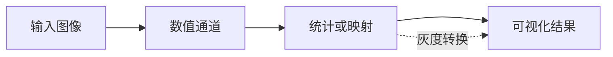

公式逐步推导

1. 感知加权。

\[
I(x,y)=0.299R(x,y)+0.587G(x,y)+0.114B(x,y)
\]

   绿色权重最大，因为人眼对绿色亮度更敏感。

2. 平均法对照。

\[
I_{avg}(x,y)=\frac{R+G+B}{3}
\]

   平均法简单，但感知效果通常不如加权法。

3. 输出范围。

\[
I(x,y)\in[0,255]
\]

   灰度结果仍然是可显示的像素值。

#### 直方图 {#algo-histogram}

解决的问题

图像过暗、过亮或对比度太低时，很多细节挤在很窄的亮度范围里。直方图和均衡化用于观察并拉开这种分布。

浅显但严谨的解释

直方图像亮度人口统计表。如果大量像素挤在暗部，画面就灰暗；均衡化会把拥挤区间摊开，让细节更明显。

分步骤流程

1. 读取图像并统一数值范围。
2. 选择亮度、颜色或噪声相关的表示。
3. 执行统计、映射或阈值决策。
4. 把结果交给后续分割、滤波或可视化环节。

中文 Mermaid 架构图

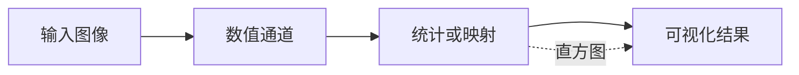

公式逐步推导

1. 亮度统计。

\[
h(k)=\sum_{x,y}\mathbf{1}(I(x,y)=k)
\]

   统计亮度为 k 的像素数量。

2. 累计分布。

\[
C(k)=\frac{1}{N}\sum_{i=0}^{k}h(i)
\]

   表示亮度不超过 k 的像素比例。

3. 均衡化映射。

\[
I'=\operatorname{round}((L-1)C(I))
\]

   把旧亮度映射到更充分的动态范围。

#### 阈值化 {#algo-threshold}

解决的问题

很多任务需要先把前景和背景分开，例如文字提取、缺陷检测和轮廓分析。阈值化把连续灰度压成二值决策。

浅显但严谨的解释

阈值就像一条分界线：比它亮的归前景，比它暗的归背景。Otsu 方法会自动寻找让两类差异最大的分界线。

分步骤流程

1. 读取图像并统一数值范围。
2. 选择亮度、颜色或噪声相关的表示。
3. 执行统计、映射或阈值决策。
4. 把结果交给后续分割、滤波或可视化环节。

中文 Mermaid 架构图

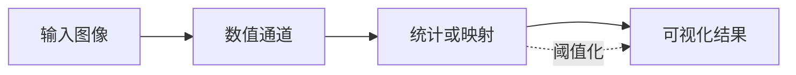

公式逐步推导

1. 二值决策。

\[
B(x,y)=\begin{cases}1,&I(x,y)\ge T\\0,&I(x,y)<T\end{cases}
\]

   T 是前景和背景的分界。

2. 类间方差。

\[
\sigma_b^2(T)=\omega_0\omega_1(\mu_0-\mu_1)^2
\]

   Otsu 选择让两类均值分得最开的阈值。

3. 最优阈值。

\[
T^*=\arg\max_T\sigma_b^2(T)
\]

   遍历候选阈值即可得到自动阈值。

#### 噪声模型 {#algo-noise}

解决的问题

椒盐噪声、高斯噪声的生成与特性。理解为什么要滤波的前提。

浅显但严谨的解释

噪声模型的核心是先把输入图像转成合适的中间表示，再用明确规则或模型得到结果。直观理解时，可以把它看成输入、表示、约束、输出四步。

分步骤流程

1. 读取图像并统一数值范围。
2. 选择亮度、颜色或噪声相关的表示。
3. 执行统计、映射或阈值决策。
4. 把结果交给后续分割、滤波或可视化环节。

中文 Mermaid 架构图

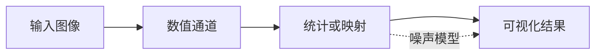

公式逐步推导

1. 像素表示。

\[
x_i=[R_i,G_i,B_i]
\]

   每个像素先被看成一个颜色向量。

2. 通道映射。

\[
z_i=f(x_i)
\]

   算法把原始颜色转成更适合任务的表示。

3. 输出结果。

\[
Y_i=g(z_i)
\]

   最终结果可以是亮度、标签或噪声后的像素。

### 滤波与卷积 {#topic-filter-and-convolution}

卷积和局部邻域是传统视觉与 CNN 的共同语言。高斯、中值、双边、Sobel 和实时滤镜都在回答同一个问题：一个像素应该怎样参考它周围的像素。

#### 基础卷积 {#algo-convolution}

解决的问题

很多图像操作都需要查看局部邻域。卷积把看周围像素再加权求和的规则写成统一公式，是滤波和 CNN 的核心。

浅显但严谨的解释

卷积核像一个小模板，在整张图上滑动。模板里的权重决定它是在模糊、锐化，还是寻找边缘。

分步骤流程

1. 确定局部窗口或卷积核。
2. 收集中心像素周围的邻域值。
3. 根据权重、排序或梯度规则计算新值。
4. 把新值写回输出图像。

中文 Mermaid 架构图


公式逐步推导

1. 二维卷积。

\[
O(x,y)=\sum_i\sum_jK(i,j)I(x-i,y-j)
\]

   输出像素来自邻域加权和。

2. 归一化核。

\[
\sum_{i,j}K(i,j)=1
\]

   平滑类卷积常让权重和为 1。

3. 整图运算。

\[
O=K\ast I
\]

   同一个卷积核作用到整张图。

#### 平滑与去噪 {#algo-smoothing}

解决的问题

统一对比高斯平滑、中值滤波和双边滤波，解释它们适合的噪声场景和中间计算过程。

浅显但严谨的解释

平滑与去噪的核心是先把输入图像转成合适的中间表示，再用明确规则或模型得到结果。直观理解时，可以把它看成输入、表示、约束、输出四步。

分步骤流程

1. 确定局部窗口或卷积核。
2. 收集中心像素周围的邻域值。
3. 根据权重、排序或梯度规则计算新值。
4. 把新值写回输出图像。

中文 Mermaid 架构图

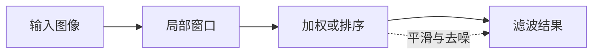

公式逐步推导

1. 邻域窗口。

\[
\mathcal{N}_{p}=\{q\mid q\text{ 在 }p\text{ 周围}\}
\]

   局部算法只看一个小范围。

2. 局部计算。

\[
I'(p)=\sum_{q\in\mathcal{N}_{p}}w(p,q)I(q)
\]

   线性滤波用邻域加权平均。

3. 权重约束。

\[
\sum_{q}w(p,q)=1
\]

   归一化能避免整体亮度漂移。

#### 高斯平滑 {#algo-gaussian}

解决的问题

平滑与去噪专题中的线性加权平均滤波，适合连续高斯噪声和快速预处理。

浅显但严谨的解释

高斯平滑的核心是先把输入图像转成合适的中间表示，再用明确规则或模型得到结果。直观理解时，可以把它看成输入、表示、约束、输出四步。

分步骤流程

1. 确定局部窗口或卷积核。
2. 收集中心像素周围的邻域值。
3. 根据权重、排序或梯度规则计算新值。
4. 把新值写回输出图像。

中文 Mermaid 架构图


公式逐步推导

1. 邻域窗口。

\[
\mathcal{N}_{p}=\{q\mid q\text{ 在 }p\text{ 周围}\}
\]

   局部算法只看一个小范围。

2. 局部计算。

\[
I'(p)=\sum_{q\in\mathcal{N}_{p}}w(p,q)I(q)
\]

   线性滤波用邻域加权平均。

3. 权重约束。

\[
\sum_{q}w(p,q)=1
\]

   归一化能避免整体亮度漂移。

#### 中值滤波 {#algo-median}

解决的问题

平滑与去噪专题中的非线性排序滤波，适合椒盐噪声和孤立坏点。

浅显但严谨的解释

中值滤波的核心是先把输入图像转成合适的中间表示，再用明确规则或模型得到结果。直观理解时，可以把它看成输入、表示、约束、输出四步。

分步骤流程

1. 确定局部窗口或卷积核。
2. 收集中心像素周围的邻域值。
3. 根据权重、排序或梯度规则计算新值。
4. 把新值写回输出图像。

中文 Mermaid 架构图

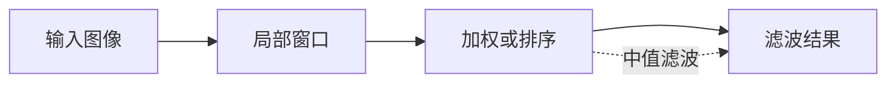

公式逐步推导

1. 邻域窗口。

\[
\mathcal{N}_{p}=\{q\mid q\text{ 在 }p\text{ 周围}\}
\]

   局部算法只看一个小范围。

2. 局部计算。

\[
I'(p)=\sum_{q\in\mathcal{N}_{p}}w(p,q)I(q)
\]

   线性滤波用邻域加权平均。

3. 权重约束。

\[
\sum_{q}w(p,q)=1
\]

   归一化能避免整体亮度漂移。

#### 双边滤波 {#algo-bilateral}

解决的问题

普通平滑会跨过边缘做平均，导致边界变糊。双边滤波同时考虑空间距离和颜色相似度，尽量保留边缘。

浅显但严谨的解释

它只相信离得近且颜色像的邻居。边缘另一侧虽然近，但颜色差大，权重会被压低。

分步骤流程

1. 确定局部窗口或卷积核。
2. 收集中心像素周围的邻域值。
3. 根据权重、排序或梯度规则计算新值。
4. 把新值写回输出图像。

中文 Mermaid 架构图

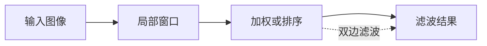

公式逐步推导

1. 邻域窗口。

\[
\mathcal{N}_{p}=\{q\mid q\text{ 在 }p\text{ 周围}\}
\]

   局部算法只看一个小范围。

2. 局部计算。

\[
I'(p)=\sum_{q\in\mathcal{N}_{p}}w(p,q)I(q)
\]

   线性滤波用邻域加权平均。

3. 权重约束。

\[
\sum_{q}w(p,q)=1
\]

   归一化能避免整体亮度漂移。

#### Sobel梯度 {#algo-sobel}

解决的问题

一阶导数算子,梯度幅值与方向。边缘检测基础。

浅显但严谨的解释

Sobel梯度的核心是先把输入图像转成合适的中间表示，再用明确规则或模型得到结果。直观理解时，可以把它看成输入、表示、约束、输出四步。

分步骤流程

1. 确定局部窗口或卷积核。
2. 收集中心像素周围的邻域值。
3. 根据权重、排序或梯度规则计算新值。
4. 把新值写回输出图像。

中文 Mermaid 架构图

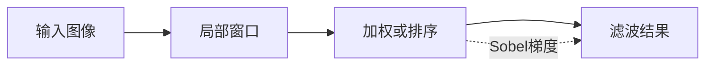

公式逐步推导

1. 邻域窗口。

\[
\mathcal{N}_{p}=\{q\mid q\text{ 在 }p\text{ 周围}\}
\]

   局部算法只看一个小范围。

2. 局部计算。

\[
I'(p)=\sum_{q\in\mathcal{N}_{p}}w(p,q)I(q)
\]

   线性滤波用邻域加权平均。

3. 权重约束。

\[
\sum_{q}w(p,q)=1
\]

   归一化能避免整体亮度漂移。

#### 实时摄像头滤镜 {#algo-live}

解决的问题

打开摄像头，实时查看不同卷积核对画面的影响——模糊、锐化、边缘增强。

浅显但严谨的解释

实时摄像头滤镜的核心是先把输入图像转成合适的中间表示，再用明确规则或模型得到结果。直观理解时，可以把它看成输入、表示、约束、输出四步。

分步骤流程

1. 确定局部窗口或卷积核。
2. 收集中心像素周围的邻域值。
3. 根据权重、排序或梯度规则计算新值。
4. 把新值写回输出图像。

中文 Mermaid 架构图

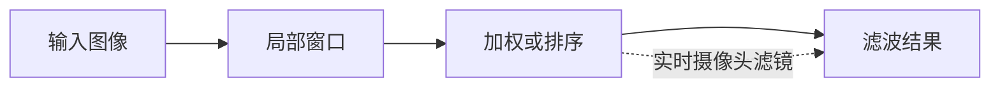

公式逐步推导

1. 邻域窗口。

\[
\mathcal{N}_{p}=\{q\mid q\text{ 在 }p\text{ 周围}\}
\]

   局部算法只看一个小范围。

2. 局部计算。

\[
I'(p)=\sum_{q\in\mathcal{N}_{p}}w(p,q)I(q)
\]

   线性滤波用邻域加权平均。

3. 权重约束。

\[
\sum_{q}w(p,q)=1
\]

   归一化能避免整体亮度漂移。

## 阶段二 · 经典结构与几何视觉 {#phase-classical-geometry}

这一阶段从像素走向结构。边缘、角点、局部描述子、区域分割、双目几何和运动估计，让系统开始理解哪里有结构，以及结构之间如何对应。

### 从边缘到角点 {#topic-edges-to-corners}

边缘描述亮度突变，角点描述两个方向同时变化的稳定位置。它们是匹配、跟踪和几何恢复的起点。

#### 边缘检测 {#algo-edge}

解决的问题

边缘检测需要在噪声中找到细而连续的结构线。Canny 把平滑、梯度、细化和连接组织成稳定流水线。

浅显但严谨的解释

Canny 先降噪，再找梯度，再把粗边缘压成细线，最后用强边缘带着弱边缘连起来。

分步骤流程

1. 计算局部亮度变化。
2. 在窗口内累积或比较变化强度。
3. 用响应函数找稳定结构。
4. 通过阈值和局部极值筛选最终点线。

中文 Mermaid 架构图

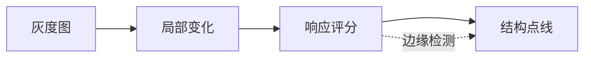

公式逐步推导

1. 平滑后求梯度。

\[
M=\|\nabla(G_\sigma\ast I)\|
\]

   先平滑再求变化强度。

2. 非极大值抑制。

\[
M(p)\ge M(p_+),\quad M(p)\ge M(p_-)
\]

   只保留梯度方向上的局部峰值。

3. 双阈值连接。

\[
E=E_{strong}\cup\operatorname{connected}(E_{weak},E_{strong})
\]

   弱边缘必须连接到强边缘才保留。

#### Harris 角点检测 {#algo-corner}

解决的问题

角点是两个方向都变化明显的位置，比单纯边缘更适合跟踪和匹配。Harris 用结构张量衡量局部变化。

浅显但严谨的解释

把一个小窗口往任意方向挪，如果内容都变很多，它就是角点；如果只沿一个方向变，它更像边缘。

分步骤流程

1. 计算局部亮度变化。
2. 在窗口内累积或比较变化强度。
3. 用响应函数找稳定结构。
4. 通过阈值和局部极值筛选最终点线。

中文 Mermaid 架构图

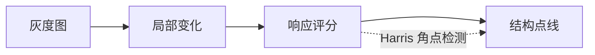

公式逐步推导

1. 结构张量。

\[
M=\sum_W\begin{bmatrix}I_x^2&I_xI_y\\I_xI_y&I_y^2\end{bmatrix}
\]

   矩阵记录两个方向的变化。

2. Harris 响应。

\[
R=\det(M)-k\operatorname{trace}(M)^2
\]

   两个特征值都大时响应高。

3. 角点选择。

\[
R(p)>T
\]

   阈值过滤低响应位置。

#### Shi-Tomasi角点 {#algo-shitomasi}

解决的问题

Shi-Tomasi 希望选出更适合跟踪的角点。它直接使用结构张量的较小特征值作为质量分数。

浅显但严谨的解释

一个点要稳定，两个方向都要有足够变化。只要较小的特征值也大，就说明它不是单纯边缘，而是真角点。

分步骤流程

1. 计算局部亮度变化。
2. 在窗口内累积或比较变化强度。
3. 用响应函数找稳定结构。
4. 通过阈值和局部极值筛选最终点线。

中文 Mermaid 架构图

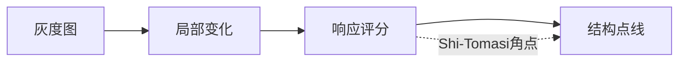

公式逐步推导

1. 特征值。

\[
\lambda_1,\lambda_2=\operatorname{eig}(M)
\]

   特征值描述两个主方向变化。

2. 质量分数。

\[
R=\min(\lambda_1,\lambda_2)
\]

   较小值也大才算稳定。

3. 筛选。

\[
R(p)>T
\]

   低质量点被排除。

### 描述与形状 {#topic-descriptors-and-shapes}

局部描述子让图像块可以被重新识别，形态学和 HOG 则把二值形状与梯度方向变成可计算的结构特征。

#### SIFT 特征检测 {#algo-sift}

解决的问题

图像缩放、旋转或光照变化后，同一局部区域仍要能被再次找到。SIFT 用尺度空间关键点和梯度描述子解决这个问题。

浅显但严谨的解释

SIFT 先在不同模糊程度和不同尺寸下找稳定点，再给每个点指定主方向，最后用周围梯度方向统计成 128 维指纹。

分步骤流程

1. 定位局部区域或二值结构。
2. 提取梯度、形状或集合特征。
3. 把局部结构编码成向量或修正后的区域。
4. 用于匹配、检测或后续几何分析。

中文 Mermaid 架构图

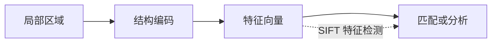

公式逐步推导

1. 尺度空间。

\[
L(x,y,\sigma)=G(x,y,\sigma)\ast I(x,y)
\]

   不同 σ 表示不同观察尺度。

2. 高斯差分。

\[
D(x,y,\sigma)=L(x,y,k\sigma)-L(x,y,\sigma)
\]

   高斯差分用于寻找尺度极值。

3. 描述子。

\[
d=\operatorname{hist}(\nabla L,\theta)
\]

   用局部梯度方向直方图编码形状。

#### 形态学操作 {#algo-morphology}

解决的问题

二值图常有毛刺、小洞或断裂。形态学用结构元素做集合运算，修正区域形状。

浅显但严谨的解释

腐蚀让白色区域缩水，膨胀让白色区域扩张；先腐蚀后膨胀是开运算，先膨胀后腐蚀是闭运算。

分步骤流程

1. 定位局部区域或二值结构。
2. 提取梯度、形状或集合特征。
3. 把局部结构编码成向量或修正后的区域。
4. 用于匹配、检测或后续几何分析。

中文 Mermaid 架构图

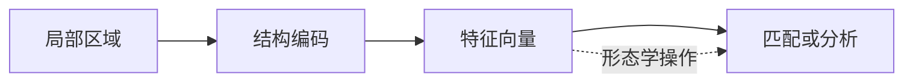

公式逐步推导

1. 局部补丁。

\[
P_p=I[\mathcal{N}_{p}]
\]

   围绕关键位置截取局部区域。

2. 特征编码。

\[
d_p=\phi(P_p)
\]

   描述子把局部外观变成向量。

3. 相似比较。

\[
s(p,q)=\operatorname{sim}(d_p,d_q)
\]

   向量相似度用于匹配或分类。

#### HOG + SVM 目标检测 {#algo-hog_svm}

解决的问题

深度学习之前的目标检测标准方案：先计算梯度方向直方图 (HOG) 作为特征，再用支持向量机 (SVM) 做分类——理解它才能理解为什么深度学习检测器更好。

浅显但严谨的解释

HOG + SVM 目标检测的核心是先把输入图像转成合适的中间表示，再用明确规则或模型得到结果。直观理解时，可以把它看成输入、表示、约束、输出四步。

分步骤流程

1. 定位局部区域或二值结构。
2. 提取梯度、形状或集合特征。
3. 把局部结构编码成向量或修正后的区域。
4. 用于匹配、检测或后续几何分析。

中文 Mermaid 架构图

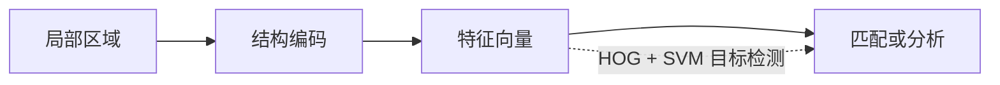

公式逐步推导

1. 局部补丁。

\[
P_p=I[\mathcal{N}_{p}]
\]

   围绕关键位置截取局部区域。

2. 特征编码。

\[
d_p=\phi(P_p)
\]

   描述子把局部外观变成向量。

3. 相似比较。

\[
s(p,q)=\operatorname{sim}(d_p,d_q)
\]

   向量相似度用于匹配或分类。

### 特征匹配 {#topic-feature-matching}

把两张图中的局部特征连接起来，再用几何一致性过滤误配，是拼接、定位和三维重建的重要前置步骤。

#### 特征匹配 {#algo-match}

解决的问题

找到两幅图像中同一个物体的对应点——图像拼接、目标识别的基石。

浅显但严谨的解释

特征匹配的核心是先把输入图像转成合适的中间表示，再用明确规则或模型得到结果。直观理解时，可以把它看成输入、表示、约束、输出四步。

分步骤流程

1. 分别提取两张图的局部特征。
2. 用描述子距离寻找候选对应。
3. 用比例检验或视觉词汇过滤不可靠匹配。
4. 用几何一致性得到可信关系。

中文 Mermaid 架构图

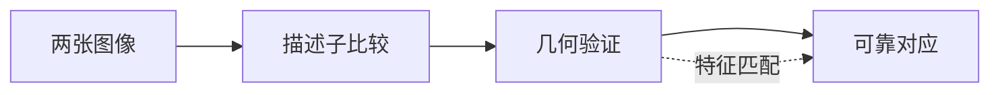

公式逐步推导

1. 距离度量。

\[
d(i,j)=\|f_i-g_j\|_2
\]

   描述子越接近，局部区域越相似。

2. 可靠性检验。

\[
\frac{d_1}{d_2}<\tau
\]

   最近邻必须明显优于次近邻。

3. 几何一致。

\[
x'\sim Hx
\]

   正确匹配应服从同一个几何模型。

#### BoVW+SPM {#algo-bovw_spm}

解决的问题

SIFT→K-Means视觉词汇→空间金字塔→Chi2SVM。传统图像分类的标准流水线。

浅显但严谨的解释

BoVW+SPM的核心是先把输入图像转成合适的中间表示，再用明确规则或模型得到结果。直观理解时，可以把它看成输入、表示、约束、输出四步。

分步骤流程

1. 分别提取两张图的局部特征。
2. 用描述子距离寻找候选对应。
3. 用比例检验或视觉词汇过滤不可靠匹配。
4. 用几何一致性得到可信关系。

中文 Mermaid 架构图

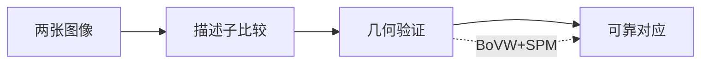

公式逐步推导

1. 距离度量。

\[
d(i,j)=\|f_i-g_j\|_2
\]

   描述子越接近，局部区域越相似。

2. 可靠性检验。

\[
\frac{d_1}{d_2}<\tau
\]

   最近邻必须明显优于次近邻。

3. 几何一致。

\[
x'\sim Hx
\]

   正确匹配应服从同一个几何模型。

### 传统分割 {#topic-classical-segmentation}

传统分割通常不依赖大模型，而是利用颜色、距离、图割、超像素或区域生长，把像素组织成更容易理解的区域。

#### K-Means分割 {#algo-kmeans}

解决的问题

RGB像素聚类,最简单的无监督分割入口。K值选择+颜色映射。

浅显但严谨的解释

K-Means分割的核心是先把输入图像转成合适的中间表示，再用明确规则或模型得到结果。直观理解时，可以把它看成输入、表示、约束、输出四步。

分步骤流程

1. 选择像素、区域或图节点作为基本单位。
2. 计算颜色、位置或边界相似性。
3. 根据相似性合并或切分区域。
4. 输出区域标签、边界或掩膜。

中文 Mermaid 架构图

```mermaid
flowchart LR
  A["输入图像"]
  B["相似性建模"]
  C["区域优化"]
  D["分割结果"]
  A --> B --> C --> D
  C -. "K-Means分割" .-> D
```

公式逐步推导

1. 像素表示。

\[
x_i=[c_i,p_i]
\]

   颜色和位置共同描述一个像素。

2. 区域代价。

\[
E(Y)=\sum_iD_i(Y_i)+\lambda\sum_{i,j}V_{ij}[Y_i\ne Y_j]
\]

   数据项关心像不像，平滑项关心边界是否合理。

3. 标签输出。

\[
Y^*=\arg\min_YE(Y)
\]

   选择代价最低的区域划分。

#### 分水岭分割 {#algo-watershed}

解决的问题

把梯度幅值图看作地形——「注水」后不同集水盆地对应不同物体。经典的分割算法，擅长分离粘连物体。

浅显但严谨的解释

分水岭分割的核心是先把输入图像转成合适的中间表示，再用明确规则或模型得到结果。直观理解时，可以把它看成输入、表示、约束、输出四步。

分步骤流程

1. 选择像素、区域或图节点作为基本单位。
2. 计算颜色、位置或边界相似性。
3. 根据相似性合并或切分区域。
4. 输出区域标签、边界或掩膜。

中文 Mermaid 架构图

```mermaid
flowchart LR
  A["输入图像"]
  B["相似性建模"]
  C["区域优化"]
  D["分割结果"]
  A --> B --> C --> D
  C -. "分水岭分割" .-> D
```

公式逐步推导

1. 像素表示。

\[
x_i=[c_i,p_i]
\]

   颜色和位置共同描述一个像素。

2. 区域代价。

\[
E(Y)=\sum_iD_i(Y_i)+\lambda\sum_{i,j}V_{ij}[Y_i\ne Y_j]
\]

   数据项关心像不像，平滑项关心边界是否合理。

3. 标签输出。

\[
Y^*=\arg\min_YE(Y)
\]

   选择代价最低的区域划分。

#### GrabCut 前景提取 {#algo-grabcut}

解决的问题

用户画一个矩形框住目标物体，算法用高斯混合模型 (GMM) 迭代优化，自动分离前景和背景——交互式抠图的经典方法。

浅显但严谨的解释

GrabCut 前景提取的核心是先把输入图像转成合适的中间表示，再用明确规则或模型得到结果。直观理解时，可以把它看成输入、表示、约束、输出四步。

分步骤流程

1. 选择像素、区域或图节点作为基本单位。
2. 计算颜色、位置或边界相似性。
3. 根据相似性合并或切分区域。
4. 输出区域标签、边界或掩膜。

中文 Mermaid 架构图

```mermaid
flowchart LR
  A["输入图像"]
  B["相似性建模"]
  C["区域优化"]
  D["分割结果"]
  A --> B --> C --> D
  C -. "GrabCut 前景提取" .-> D
```

公式逐步推导

1. 像素表示。

\[
x_i=[c_i,p_i]
\]

   颜色和位置共同描述一个像素。

2. 区域代价。

\[
E(Y)=\sum_iD_i(Y_i)+\lambda\sum_{i,j}V_{ij}[Y_i\ne Y_j]
\]

   数据项关心像不像，平滑项关心边界是否合理。

3. 标签输出。

\[
Y^*=\arg\min_YE(Y)
\]

   选择代价最低的区域划分。

#### SLIC 超像素 {#algo-slic}

解决的问题

将图像分割成紧凑、均匀的「超级像素」块——每个超像素内的像素颜色和位置都相近。大幅降低后续处理的复杂度，是很多高级算法的预处理步骤。

浅显但严谨的解释

SLIC 超像素的核心是先把输入图像转成合适的中间表示，再用明确规则或模型得到结果。直观理解时，可以把它看成输入、表示、约束、输出四步。

分步骤流程

1. 选择像素、区域或图节点作为基本单位。
2. 计算颜色、位置或边界相似性。
3. 根据相似性合并或切分区域。
4. 输出区域标签、边界或掩膜。

中文 Mermaid 架构图

```mermaid
flowchart LR
  A["输入图像"]
  B["相似性建模"]
  C["区域优化"]
  D["分割结果"]
  A --> B --> C --> D
  C -. "SLIC 超像素" .-> D
```

公式逐步推导

1. 像素表示。

\[
x_i=[c_i,p_i]
\]

   颜色和位置共同描述一个像素。

2. 区域代价。

\[
E(Y)=\sum_iD_i(Y_i)+\lambda\sum_{i,j}V_{ij}[Y_i\ne Y_j]
\]

   数据项关心像不像，平滑项关心边界是否合理。

3. 标签输出。

\[
Y^*=\arg\min_YE(Y)
\]

   选择代价最低的区域划分。

#### Normalized Cuts {#algo-ncuts}

解决的问题

谱聚类:拉普拉斯矩阵→Fiedler向量→递归二分。基于图割的全局分割方法。

浅显但严谨的解释

Normalized Cuts的核心是先把输入图像转成合适的中间表示，再用明确规则或模型得到结果。直观理解时，可以把它看成输入、表示、约束、输出四步。

分步骤流程

1. 选择像素、区域或图节点作为基本单位。
2. 计算颜色、位置或边界相似性。
3. 根据相似性合并或切分区域。
4. 输出区域标签、边界或掩膜。

中文 Mermaid 架构图

```mermaid
flowchart LR
  A["输入图像"]
  B["相似性建模"]
  C["区域优化"]
  D["分割结果"]
  A --> B --> C --> D
  C -. "Normalized Cuts" .-> D
```

公式逐步推导

1. 像素表示。

\[
x_i=[c_i,p_i]
\]

   颜色和位置共同描述一个像素。

2. 区域代价。

\[
E(Y)=\sum_iD_i(Y_i)+\lambda\sum_{i,j}V_{ij}[Y_i\ne Y_j]
\]

   数据项关心像不像，平滑项关心边界是否合理。

3. 标签输出。

\[
Y^*=\arg\min_YE(Y)
\]

   选择代价最低的区域划分。

### 运动、深度与频域 {#topic-motion-depth-frequency}

这一组方法把图像放到时间、空间和频率中理解：光流看运动，双目和标定看三维，频域看变化速度。

#### 光流 {#algo-optical_flow}

解决的问题

视频中物体会移动，光流估计相邻帧中每个位置的运动方向和速度。

浅显但严谨的解释

短时间内同一个点的亮度近似不变。它在下一帧换了位置，于是空间变化和时间变化可以一起约束运动。

分步骤流程

1. 从多帧、多视图或频域表示中提取约束。
2. 建立运动、投影、视差或频率模型。
3. 通过搜索或优化估计参数。
4. 输出运动、深度、相机或频域处理结果。

中文 Mermaid 架构图

```mermaid
flowchart LR
  A["多帧或多视图"]
  B["几何约束"]
  C["优化估计"]
  D["运动或三维结果"]
  A --> B --> C --> D
  C -. "光流" .-> D
```

公式逐步推导

1. 投影关系。

\[
x\sim K[R\mid t]X
\]

   三维点通过相机模型投到图像上。

2. 几何误差。

\[
e_i=\|x_i-\pi(PX_i)\|
\]

   误差越小，几何解释越一致。

3. 优化目标。

\[
\min\sum_i e_i^2
\]

   用最小化误差估计未知量。

#### 立体匹配与深度 {#algo-stereo}

解决的问题

双目相机从左右图像的位移差估计深度。视差越大，物体通常越近。

浅显但严谨的解释

左右眼看到同一物体的位置不同。找到对应点后，横向差值就是视差，结合焦距和基线就能算深度。

分步骤流程

1. 从多帧、多视图或频域表示中提取约束。
2. 建立运动、投影、视差或频率模型。
3. 通过搜索或优化估计参数。
4. 输出运动、深度、相机或频域处理结果。

中文 Mermaid 架构图

```mermaid
flowchart LR
  A["多帧或多视图"]
  B["几何约束"]
  C["优化估计"]
  D["运动或三维结果"]
  A --> B --> C --> D
  C -. "立体匹配与深度" .-> D
```

公式逐步推导

1. 投影关系。

\[
x\sim K[R\mid t]X
\]

   三维点通过相机模型投到图像上。

2. 几何误差。

\[
e_i=\|x_i-\pi(PX_i)\|
\]

   误差越小，几何解释越一致。

3. 优化目标。

\[
\min\sum_i e_i^2
\]

   用最小化误差估计未知量。

#### 频域分析 {#algo-frequency}

解决的问题

傅里叶变换揭示图像的频率成分：低频对应平滑区域，高频对应边缘和噪声。

浅显但严谨的解释

频域分析的核心是先把输入图像转成合适的中间表示，再用明确规则或模型得到结果。直观理解时，可以把它看成输入、表示、约束、输出四步。

分步骤流程

1. 从多帧、多视图或频域表示中提取约束。
2. 建立运动、投影、视差或频率模型。
3. 通过搜索或优化估计参数。
4. 输出运动、深度、相机或频域处理结果。

中文 Mermaid 架构图

```mermaid
flowchart LR
  A["多帧或多视图"]
  B["几何约束"]
  C["优化估计"]
  D["运动或三维结果"]
  A --> B --> C --> D
  C -. "频域分析" .-> D
```

公式逐步推导

1. 投影关系。

\[
x\sim K[R\mid t]X
\]

   三维点通过相机模型投到图像上。

2. 几何误差。

\[
e_i=\|x_i-\pi(PX_i)\|
\]

   误差越小，几何解释越一致。

3. 优化目标。

\[
\min\sum_i e_i^2
\]

   用最小化误差估计未知量。

#### 相机标定 {#algo-calibration}

解决的问题

相机把三维点投影成二维像素，会受到焦距、主点和畸变影响。标定用于估计这些参数。

浅显但严谨的解释

棋盘格的真实几何已知，图像上的角点也能检测。让投影模型尽量对齐这些点，就能反推出相机参数。

分步骤流程

1. 从多帧、多视图或频域表示中提取约束。
2. 建立运动、投影、视差或频率模型。
3. 通过搜索或优化估计参数。
4. 输出运动、深度、相机或频域处理结果。

中文 Mermaid 架构图

```mermaid
flowchart LR
  A["多帧或多视图"]
  B["几何约束"]
  C["优化估计"]
  D["运动或三维结果"]
  A --> B --> C --> D
  C -. "相机标定" .-> D
```

公式逐步推导

1. 投影关系。

\[
x\sim K[R\mid t]X
\]

   三维点通过相机模型投到图像上。

2. 几何误差。

\[
e_i=\|x_i-\pi(PX_i)\|
\]

   误差越小，几何解释越一致。

3. 优化目标。

\[
\min\sum_i e_i^2
\]

   用最小化误差估计未知量。

#### 对极几何 {#algo-epipolar}

解决的问题

F/E矩阵→8点法→SVD恢复R,t。从两视图匹配点对恢复相机相对运动。

浅显但严谨的解释

对极几何的核心是先把输入图像转成合适的中间表示，再用明确规则或模型得到结果。直观理解时，可以把它看成输入、表示、约束、输出四步。

分步骤流程

1. 从多帧、多视图或频域表示中提取约束。
2. 建立运动、投影、视差或频率模型。
3. 通过搜索或优化估计参数。
4. 输出运动、深度、相机或频域处理结果。

中文 Mermaid 架构图

```mermaid
flowchart LR
  A["多帧或多视图"]
  B["几何约束"]
  C["优化估计"]
  D["运动或三维结果"]
  A --> B --> C --> D
  C -. "对极几何" .-> D
```

公式逐步推导

1. 投影关系。

\[
x\sim K[R\mid t]X
\]

   三维点通过相机模型投到图像上。

2. 几何误差。

\[
e_i=\|x_i-\pi(PX_i)\|
\]

   误差越小，几何解释越一致。

3. 优化目标。

\[
\min\sum_i e_i^2
\]

   用最小化误差估计未知量。

#### 三角测量与SfM {#algo-sfm}

解决的问题

P₀,P₁→SVD线性三角化→稀疏3D点云。从两视图恢复三维结构。

浅显但严谨的解释

三角测量与SfM的核心是先把输入图像转成合适的中间表示，再用明确规则或模型得到结果。直观理解时，可以把它看成输入、表示、约束、输出四步。

分步骤流程

1. 从多帧、多视图或频域表示中提取约束。
2. 建立运动、投影、视差或频率模型。
3. 通过搜索或优化估计参数。
4. 输出运动、深度、相机或频域处理结果。

中文 Mermaid 架构图

```mermaid
flowchart LR
  A["多帧或多视图"]
  B["几何约束"]
  C["优化估计"]
  D["运动或三维结果"]
  A --> B --> C --> D
  C -. "三角测量与SfM" .-> D
```

公式逐步推导

1. 投影关系。

\[
x\sim K[R\mid t]X
\]

   三维点通过相机模型投到图像上。

2. 几何误差。

\[
e_i=\|x_i-\pi(PX_i)\|
\]

   误差越小，几何解释越一致。

3. 优化目标。

\[
\min\sum_i e_i^2
\]

   用最小化误差估计未知量。

## 阶段三 · 深度学习时代 {#phase-deep-learning}

深度学习让视觉系统从手工规则转向数据驱动。卷积网络学习特征，检测和分割网络直接输出语义结果，生成模型学习数据分布。

### AI 之眼 {#topic-ai-eye}

同一张图可以用检测框、语义类别图、实例掩膜和单阶段检测网格来理解。这里把视觉理解的几种输出形式放在一起比较。

#### 目标检测 {#algo-detection}

解决的问题

目标检测回答图里有什么、在哪里。它输出类别、置信度和矩形框。

浅显但严谨的解释

检测模型先提取图像特征，再在不同位置预测候选框和类别，最后过滤低分或重复框。

分步骤流程

1. 把图像归一化并送入骨干网络。
2. 提取多层语义特征。
3. 用任务头预测类别、框或像素掩膜。
4. 按阈值、上采样或后处理得到可视化结果。

中文 Mermaid 架构图

```mermaid
flowchart LR
  A["输入图像"]
  B["深度特征"]
  C["任务预测头"]
  D["语义结果"]
  A --> B --> C --> D
  C -. "目标检测" .-> D
```

公式逐步推导

1. 特征提取。

\[
F=\operatorname{Backbone}(I)
\]

   骨干网络把像素变成语义特征。

2. 任务预测。

\[
Y=\operatorname{Head}(F)
\]

   检测头或分割头输出任务结果。

3. 联合损失。

\[
\mathcal{L}=\mathcal{L}_{cls}+\mathcal{L}_{loc}+\mathcal{L}_{mask}
\]

   多任务模型常把分类、定位和掩膜损失相加。

#### 语义分割 {#algo-semantic}

解决的问题

语义分割给每个像素分配类别，但不区分同类中的不同个体。

浅显但严谨的解释

它像给整张图铺一张类别地图：道路、天空、人、车各自有颜色。

分步骤流程

1. 把图像归一化并送入骨干网络。
2. 提取多层语义特征。
3. 用任务头预测类别、框或像素掩膜。
4. 按阈值、上采样或后处理得到可视化结果。

中文 Mermaid 架构图

```mermaid
flowchart LR
  A["输入图像"]
  B["深度特征"]
  C["任务预测头"]
  D["语义结果"]
  A --> B --> C --> D
  C -. "语义分割" .-> D
```

公式逐步推导

1. 特征提取。

\[
F=\operatorname{Backbone}(I)
\]

   骨干网络把像素变成语义特征。

2. 任务预测。

\[
Y=\operatorname{Head}(F)
\]

   检测头或分割头输出任务结果。

3. 联合损失。

\[
\mathcal{L}=\mathcal{L}_{cls}+\mathcal{L}_{loc}+\mathcal{L}_{mask}
\]

   多任务模型常把分类、定位和掩膜损失相加。

#### 实例分割 {#algo-instance}

解决的问题

实例分割不仅要知道像素类别，还要把同类物体一个个分开。

浅显但严谨的解释

语义分割说这里都是人，实例分割还要说明这是第一个人、第二个人。

分步骤流程

1. 把图像归一化并送入骨干网络。
2. 提取多层语义特征。
3. 用任务头预测类别、框或像素掩膜。
4. 按阈值、上采样或后处理得到可视化结果。

中文 Mermaid 架构图

```mermaid
flowchart LR
  A["输入图像"]
  B["深度特征"]
  C["任务预测头"]
  D["语义结果"]
  A --> B --> C --> D
  C -. "实例分割" .-> D
```

公式逐步推导

1. 特征提取。

\[
F=\operatorname{Backbone}(I)
\]

   骨干网络把像素变成语义特征。

2. 任务预测。

\[
Y=\operatorname{Head}(F)
\]

   检测头或分割头输出任务结果。

3. 联合损失。

\[
\mathcal{L}=\mathcal{L}_{cls}+\mathcal{L}_{loc}+\mathcal{L}_{mask}
\]

   多任务模型常把分类、定位和掩膜损失相加。

#### YOLO {#algo-yolo}

解决的问题

YOLO 追求快速检测，把整张图一次性划成网格并直接预测框和类别。

浅显但严谨的解释

它不像两阶段检测先找候选区域，而是每个网格同时猜这里有没有物体和框在哪里。

分步骤流程

1. 把图像归一化并送入骨干网络。
2. 提取多层语义特征。
3. 用任务头预测类别、框或像素掩膜。
4. 按阈值、上采样或后处理得到可视化结果。

中文 Mermaid 架构图

```mermaid
flowchart LR
  A["输入图像"]
  B["深度特征"]
  C["任务预测头"]
  D["语义结果"]
  A --> B --> C --> D
  C -. "YOLO" .-> D
```

公式逐步推导

1. 特征提取。

\[
F=\operatorname{Backbone}(I)
\]

   骨干网络把像素变成语义特征。

2. 任务预测。

\[
Y=\operatorname{Head}(F)
\]

   检测头或分割头输出任务结果。

3. 联合损失。

\[
\mathcal{L}=\mathcal{L}_{cls}+\mathcal{L}_{loc}+\mathcal{L}_{mask}
\]

   多任务模型常把分类、定位和掩膜损失相加。

#### U-Net {#algo-unet}

解决的问题

U-Net 在像素级分割中兼顾全局语义和边界细节。

浅显但严谨的解释

编码器看懂整体，解码器恢复尺寸，跳跃连接把早期细节送回后面，边界就不容易丢。

分步骤流程

1. 把图像归一化并送入骨干网络。
2. 提取多层语义特征。
3. 用任务头预测类别、框或像素掩膜。
4. 按阈值、上采样或后处理得到可视化结果。

中文 Mermaid 架构图

```mermaid
flowchart LR
  A["输入图像"]
  B["深度特征"]
  C["任务预测头"]
  D["语义结果"]
  A --> B --> C --> D
  C -. "U-Net" .-> D
```

公式逐步推导

1. 特征提取。

\[
F=\operatorname{Backbone}(I)
\]

   骨干网络把像素变成语义特征。

2. 任务预测。

\[
Y=\operatorname{Head}(F)
\]

   检测头或分割头输出任务结果。

3. 联合损失。

\[
\mathcal{L}=\mathcal{L}_{cls}+\mathcal{L}_{loc}+\mathcal{L}_{mask}
\]

   多任务模型常把分类、定位和掩膜损失相加。

### CNN 基石 {#topic-cnn-foundations}

CNN 用卷积层、非线性、池化和全连接层逐级组织视觉信息；残差连接和训练可视化帮助理解深层网络为什么可训练。

#### CNN基础 {#algo-cnn_basics}

解决的问题

Conv→ReLU→Pool→FC。三个子实验：卷积可视化、LeNet实时推理、训练与反向传播。

浅显但严谨的解释

CNN基础的核心是先把输入图像转成合适的中间表示，再用明确规则或模型得到结果。直观理解时，可以把它看成输入、表示、约束、输出四步。

分步骤流程

1. 用卷积层提取局部模式。
2. 通过非线性和池化增加表达能力与稳健性。
3. 堆叠多层得到高级语义。
4. 用分类头、热力图或训练曲线解释结果。

中文 Mermaid 架构图

```mermaid
flowchart LR
  A["输入张量"]
  B["卷积特征"]
  C["深层语义"]
  D["预测或解释"]
  A --> B --> C --> D
  C -. "CNN基础" .-> D
```

公式逐步推导

1. 卷积层。

\[
H_l=\phi(W_l\ast H_{l-1}+b_l)
\]

   卷积、偏置和非线性形成一层特征。

2. 残差形式。

\[
H_l=F(H_{l-1})+H_{l-1}
\]

   跳跃连接让信息和梯度更容易通过深层网络。

3. 参数更新。

\[
\theta\leftarrow\theta-\eta\nabla_\theta\mathcal{L}
\]

   训练通过损失梯度更新参数。

#### LeNet 手写数字识别 {#algo-lenet}

解决的问题

经典 CNN 的前向推理与训练过程全可视化：卷积层特征图、反向传播梯度流。

浅显但严谨的解释

LeNet 手写数字识别的核心是先把输入图像转成合适的中间表示，再用明确规则或模型得到结果。直观理解时，可以把它看成输入、表示、约束、输出四步。

分步骤流程

1. 用卷积层提取局部模式。
2. 通过非线性和池化增加表达能力与稳健性。
3. 堆叠多层得到高级语义。
4. 用分类头、热力图或训练曲线解释结果。

中文 Mermaid 架构图

```mermaid
flowchart LR
  A["输入张量"]
  B["卷积特征"]
  C["深层语义"]
  D["预测或解释"]
  A --> B --> C --> D
  C -. "LeNet 手写数字识别" .-> D
```

公式逐步推导

1. 卷积层。

\[
H_l=\phi(W_l\ast H_{l-1}+b_l)
\]

   卷积、偏置和非线性形成一层特征。

2. 残差形式。

\[
H_l=F(H_{l-1})+H_{l-1}
\]

   跳跃连接让信息和梯度更容易通过深层网络。

3. 参数更新。

\[
\theta\leftarrow\theta-\eta\nabla_\theta\mathcal{L}
\]

   训练通过损失梯度更新参数。

#### 训练观察 {#algo-conv_training}

解决的问题

实时观察 LeNet-5 训练过程中的参数变化与损失曲线：权重分布如何从随机初始化逐步收敛到有意义的滤波器。

浅显但严谨的解释

训练观察的核心是先把输入图像转成合适的中间表示，再用明确规则或模型得到结果。直观理解时，可以把它看成输入、表示、约束、输出四步。

分步骤流程

1. 用卷积层提取局部模式。
2. 通过非线性和池化增加表达能力与稳健性。
3. 堆叠多层得到高级语义。
4. 用分类头、热力图或训练曲线解释结果。

中文 Mermaid 架构图

```mermaid
flowchart LR
  A["输入张量"]
  B["卷积特征"]
  C["深层语义"]
  D["预测或解释"]
  A --> B --> C --> D
  C -. "训练观察" .-> D
```

公式逐步推导

1. 卷积层。

\[
H_l=\phi(W_l\ast H_{l-1}+b_l)
\]

   卷积、偏置和非线性形成一层特征。

2. 残差形式。

\[
H_l=F(H_{l-1})+H_{l-1}
\]

   跳跃连接让信息和梯度更容易通过深层网络。

3. 参数更新。

\[
\theta\leftarrow\theta-\eta\nabla_\theta\mathcal{L}
\]

   训练通过损失梯度更新参数。

#### ResNet+Grad-CAM {#algo-resnet}

解决的问题

深层网络容易退化和梯度传播困难。ResNet 用残差连接让信息跨层直达。

浅显但严谨的解释

残差块不强迫每层重新学习完整变换，而是学习还需要补什么。

分步骤流程

1. 用卷积层提取局部模式。
2. 通过非线性和池化增加表达能力与稳健性。
3. 堆叠多层得到高级语义。
4. 用分类头、热力图或训练曲线解释结果。

中文 Mermaid 架构图

```mermaid
flowchart LR
  A["输入张量"]
  B["卷积特征"]
  C["深层语义"]
  D["预测或解释"]
  A --> B --> C --> D
  C -. "ResNet+Grad-CAM" .-> D
```

公式逐步推导

1. 卷积层。

\[
H_l=\phi(W_l\ast H_{l-1}+b_l)
\]

   卷积、偏置和非线性形成一层特征。

2. 残差形式。

\[
H_l=F(H_{l-1})+H_{l-1}
\]

   跳跃连接让信息和梯度更容易通过深层网络。

3. 参数更新。

\[
\theta\leftarrow\theta-\eta\nabla_\theta\mathcal{L}
\]

   训练通过损失梯度更新参数。

### 生成模型 {#topic-generative-models}

GAN 用对抗学习逼近真实分布，扩散模型把生成拆成加噪和去噪两条过程。它们把视觉从识别推进到创造。

#### GAN 生成对抗网络 {#algo-gan}

解决的问题

GAN 通过生成器和判别器博弈，让生成器学会产生接近真实分布的样本。

浅显但严谨的解释

生成器负责造样本，判别器负责分辨真假。双方一起进步，生成样本会越来越像真实数据。

分步骤流程

1. 定义随机噪声或带噪样本。
2. 用生成器、判别器或去噪网络建模数据分布。
3. 计算对抗损失或去噪损失。
4. 逐步得到更像真实数据的样本。

中文 Mermaid 架构图

```mermaid
flowchart LR
  A["随机变量"]
  B["生成机制"]
  C["损失约束"]
  D["生成样本"]
  A --> B --> C --> D
  C -. "GAN 生成对抗网络" .-> D
```

公式逐步推导

1. 对抗目标。

\[
\min_G\max_D\mathbb{E}_{x}[\log D(x)]+\mathbb{E}_{z}[\log(1-D(G(z)))]
\]

   判别器分真假，生成器骗过判别器。

2. 生成样本。

\[
\hat{x}=G(z)
\]

   随机变量被映射成样本。

3. 判别分数。

\[
s=D(x)
\]

   分数表示真实概率。

#### 扩散模型 {#algo-diffusion}

解决的问题

扩散模型把生成拆成前向加噪和反向去噪，训练目标稳定，生成多样性好。

浅显但严谨的解释

先学会怎样把清晰图逐步变成噪声，再训练网络反过来一步步把噪声擦掉。

分步骤流程

1. 定义随机噪声或带噪样本。
2. 用生成器、判别器或去噪网络建模数据分布。
3. 计算对抗损失或去噪损失。
4. 逐步得到更像真实数据的样本。

中文 Mermaid 架构图

```mermaid
flowchart LR
  A["随机变量"]
  B["生成机制"]
  C["损失约束"]
  D["生成样本"]
  A --> B --> C --> D
  C -. "扩散模型" .-> D
```

公式逐步推导

1. 潜变量。

\[
z\sim p(z)
\]

   生成从随机潜变量开始。

2. 生成映射。

\[
\hat{x}=G_\theta(z)
\]

   生成器把随机量变成样本。

3. 优化目标。

\[
\min_\theta\mathbb{E}[\mathcal{L}(x,\hat{x})]
\]

   训练让生成结果接近数据分布。

## 阶段四 · 前沿基础模型 {#phase-foundation-models}

前沿模型把 Transformer、多模态对齐、提示分割、可控生成、自监督和三维感知连接起来。重点不只是某个任务，而是能迁移、能交互、能扩展的视觉表征。

### Transformer 视觉 {#topic-transformer-vision}

图像被切成 token 后，自注意力可以建模全局关系；检测、窗口注意力和开放词汇定位都可以纳入这个框架。

#### Vision Transformer {#algo-vit}

解决的问题

ViT 探索不用卷积处理图像，把图片切成 patch token 后交给 Transformer。

浅显但严谨的解释

它把图像块当成词，位置编码说明每块在哪里，自注意力决定哪些图像块互相参考。

分步骤流程

1. 把图像切成 patch 或候选 token。
2. 加入位置编码和任务查询。
3. 用自注意力或交叉注意力交换信息。
4. 把输出 token 解码成分类、框或区域结果。

中文 Mermaid 架构图

```mermaid
flowchart LR
  A["图像 token"]
  B["注意力交互"]
  C["任务查询"]
  D["预测结果"]
  A --> B --> C --> D
  C -. "Vision Transformer" .-> D
```

公式逐步推导

1. 注意力。

\[
\operatorname{Attn}(Q,K,V)=\operatorname{softmax}\left(\frac{QK^T}{\sqrt{d}}\right)V
\]

   查询根据相似度从键值中取信息。

2. 残差块。

\[
Z_{l+1}=Z_l+\operatorname{MSA}(Z_l)
\]

   Transformer 通过残差堆叠。

3. 任务输出。

\[
Y=\operatorname{Decode}(Z_L)
\]

   最终 token 被解码成任务结果。

#### Swin Transformer {#algo-swin}

解决的问题

Swin Transformer

浅显但严谨的解释

Swin Transformer的核心是先把输入图像转成合适的中间表示，再用明确规则或模型得到结果。直观理解时，可以把它看成输入、表示、约束、输出四步。

分步骤流程

1. 把图像切成 patch 或候选 token。
2. 加入位置编码和任务查询。
3. 用自注意力或交叉注意力交换信息。
4. 把输出 token 解码成分类、框或区域结果。

中文 Mermaid 架构图

```mermaid
flowchart LR
  A["图像 token"]
  B["注意力交互"]
  C["任务查询"]
  D["预测结果"]
  A --> B --> C --> D
  C -. "Swin Transformer" .-> D
```

公式逐步推导

1. 注意力。

\[
\operatorname{Attn}(Q,K,V)=\operatorname{softmax}\left(\frac{QK^T}{\sqrt{d}}\right)V
\]

   查询根据相似度从键值中取信息。

2. 残差块。

\[
Z_{l+1}=Z_l+\operatorname{MSA}(Z_l)
\]

   Transformer 通过残差堆叠。

3. 任务输出。

\[
Y=\operatorname{Decode}(Z_L)
\]

   最终 token 被解码成任务结果。

#### DETR 目标检测 {#algo-detr}

解决的问题

DETR 把检测改成集合预测，减少手工候选框和重复框后处理。

浅显但严谨的解释

一组 object query 像一组提问者，每个 query 负责找一个可能的目标。

分步骤流程

1. 把图像切成 patch 或候选 token。
2. 加入位置编码和任务查询。
3. 用自注意力或交叉注意力交换信息。
4. 把输出 token 解码成分类、框或区域结果。

中文 Mermaid 架构图

```mermaid
flowchart LR
  A["图像 token"]
  B["注意力交互"]
  C["任务查询"]
  D["预测结果"]
  A --> B --> C --> D
  C -. "DETR 目标检测" .-> D
```

公式逐步推导

1. 注意力。

\[
\operatorname{Attn}(Q,K,V)=\operatorname{softmax}\left(\frac{QK^T}{\sqrt{d}}\right)V
\]

   查询根据相似度从键值中取信息。

2. 残差块。

\[
Z_{l+1}=Z_l+\operatorname{MSA}(Z_l)
\]

   Transformer 通过残差堆叠。

3. 任务输出。

\[
Y=\operatorname{Decode}(Z_L)
\]

   最终 token 被解码成任务结果。

#### DINO检测 {#algo-dino_det}

解决的问题

DINO Detection

浅显但严谨的解释

DINO检测的核心是先把输入图像转成合适的中间表示，再用明确规则或模型得到结果。直观理解时，可以把它看成输入、表示、约束、输出四步。

分步骤流程

1. 把图像切成 patch 或候选 token。
2. 加入位置编码和任务查询。
3. 用自注意力或交叉注意力交换信息。
4. 把输出 token 解码成分类、框或区域结果。

中文 Mermaid 架构图

```mermaid
flowchart LR
  A["图像 token"]
  B["注意力交互"]
  C["任务查询"]
  D["预测结果"]
  A --> B --> C --> D
  C -. "DINO检测" .-> D
```

公式逐步推导

1. 注意力。

\[
\operatorname{Attn}(Q,K,V)=\operatorname{softmax}\left(\frac{QK^T}{\sqrt{d}}\right)V
\]

   查询根据相似度从键值中取信息。

2. 残差块。

\[
Z_{l+1}=Z_l+\operatorname{MSA}(Z_l)
\]

   Transformer 通过残差堆叠。

3. 任务输出。

\[
Y=\operatorname{Decode}(Z_L)
\]

   最终 token 被解码成任务结果。

#### Grounding DINO {#algo-grdino}

解决的问题

Grounding DINO

浅显但严谨的解释

Grounding DINO的核心是先把输入图像转成合适的中间表示，再用明确规则或模型得到结果。直观理解时，可以把它看成输入、表示、约束、输出四步。

分步骤流程

1. 把图像切成 patch 或候选 token。
2. 加入位置编码和任务查询。
3. 用自注意力或交叉注意力交换信息。
4. 把输出 token 解码成分类、框或区域结果。

中文 Mermaid 架构图

```mermaid
flowchart LR
  A["图像 token"]
  B["注意力交互"]
  C["任务查询"]
  D["预测结果"]
  A --> B --> C --> D
  C -. "Grounding DINO" .-> D
```

公式逐步推导

1. 注意力。

\[
\operatorname{Attn}(Q,K,V)=\operatorname{softmax}\left(\frac{QK^T}{\sqrt{d}}\right)V
\]

   查询根据相似度从键值中取信息。

2. 残差块。

\[
Z_{l+1}=Z_l+\operatorname{MSA}(Z_l)
\]

   Transformer 通过残差堆叠。

3. 任务输出。

\[
Y=\operatorname{Decode}(Z_L)
\]

   最终 token 被解码成任务结果。

### 分割与多模态基础模型 {#topic-segmentation-multimodal}

图像、文字、提示点和掩膜进入同一个系统：CLIP 对齐图文，SAM 接受提示，Mask2Former 统一分割形式，BLIP-2 把视觉接入语言模型。

#### CLIP 多模态模型 {#algo-clip}

解决的问题

CLIP 把图像和文本放进同一向量空间，让自然语言可以检索和分类图像。

浅显但严谨的解释

正确的图文对应该相互靠近，不匹配的图文对应该远离。

分步骤流程

1. 编码图像、文本或提示。
2. 把不同模态映射到可比较的特征空间。
3. 通过相似度、注意力或解码器融合信息。
4. 输出分类、描述、问答或掩膜。

中文 Mermaid 架构图

```mermaid
flowchart LR
  A["图像与提示"]
  B["特征对齐"]
  C["融合解码"]
  D["文字或掩膜"]
  A --> B --> C --> D
  C -. "CLIP 多模态模型" .-> D
```

公式逐步推导

1. 图像特征。

\[
z_I=f_I(I)
\]

   视觉编码器得到图像向量。

2. 文本或提示特征。

\[
z_T=f_T(T)
\]

   文本或提示编码器得到条件向量。

3. 对齐分数。

\[
s=\frac{z_I^Tz_T}{\|z_I\|\|z_T\|}
\]

   余弦相似度衡量匹配程度。

#### SAM 分割一切 {#algo-sam}

解决的问题

SAM 把分割变成提示驱动任务，点、框或粗略提示都能引导模型输出掩膜。

浅显但严谨的解释

图像编码器先理解整张图，提示编码器说明用户关心哪里，掩膜解码器给出对应区域。

分步骤流程

1. 编码图像、文本或提示。
2. 把不同模态映射到可比较的特征空间。
3. 通过相似度、注意力或解码器融合信息。
4. 输出分类、描述、问答或掩膜。

中文 Mermaid 架构图

```mermaid
flowchart LR
  A["图像与提示"]
  B["特征对齐"]
  C["融合解码"]
  D["文字或掩膜"]
  A --> B --> C --> D
  C -. "SAM 分割一切" .-> D
```

公式逐步推导

1. 图像特征。

\[
z_I=f_I(I)
\]

   视觉编码器得到图像向量。

2. 文本或提示特征。

\[
z_T=f_T(T)
\]

   文本或提示编码器得到条件向量。

3. 对齐分数。

\[
s=\frac{z_I^Tz_T}{\|z_I\|\|z_T\|}
\]

   余弦相似度衡量匹配程度。

#### SAM 2 {#algo-sam2}

解决的问题

SAM 2

浅显但严谨的解释

SAM 2的核心是先把输入图像转成合适的中间表示，再用明确规则或模型得到结果。直观理解时，可以把它看成输入、表示、约束、输出四步。

分步骤流程

1. 编码图像、文本或提示。
2. 把不同模态映射到可比较的特征空间。
3. 通过相似度、注意力或解码器融合信息。
4. 输出分类、描述、问答或掩膜。

中文 Mermaid 架构图

```mermaid
flowchart LR
  A["图像与提示"]
  B["特征对齐"]
  C["融合解码"]
  D["文字或掩膜"]
  A --> B --> C --> D
  C -. "SAM 2" .-> D
```

公式逐步推导

1. 图像特征。

\[
z_I=f_I(I)
\]

   视觉编码器得到图像向量。

2. 文本或提示特征。

\[
z_T=f_T(T)
\]

   文本或提示编码器得到条件向量。

3. 对齐分数。

\[
s=\frac{z_I^Tz_T}{\|z_I\|\|z_T\|}
\]

   余弦相似度衡量匹配程度。

#### BLIP-2 {#algo-blip2}

解决的问题

BLIP-2

浅显但严谨的解释

BLIP-2的核心是先把输入图像转成合适的中间表示，再用明确规则或模型得到结果。直观理解时，可以把它看成输入、表示、约束、输出四步。

分步骤流程

1. 编码图像、文本或提示。
2. 把不同模态映射到可比较的特征空间。
3. 通过相似度、注意力或解码器融合信息。
4. 输出分类、描述、问答或掩膜。

中文 Mermaid 架构图

```mermaid
flowchart LR
  A["图像与提示"]
  B["特征对齐"]
  C["融合解码"]
  D["文字或掩膜"]
  A --> B --> C --> D
  C -. "BLIP-2" .-> D
```

公式逐步推导

1. 图像特征。

\[
z_I=f_I(I)
\]

   视觉编码器得到图像向量。

2. 文本或提示特征。

\[
z_T=f_T(T)
\]

   文本或提示编码器得到条件向量。

3. 对齐分数。

\[
s=\frac{z_I^Tz_T}{\|z_I\|\|z_T\|}
\]

   余弦相似度衡量匹配程度。

#### Mask2Former {#algo-mask2former}

解决的问题

Mask2Former

浅显但严谨的解释

Mask2Former的核心是先把输入图像转成合适的中间表示，再用明确规则或模型得到结果。直观理解时，可以把它看成输入、表示、约束、输出四步。

分步骤流程

1. 编码图像、文本或提示。
2. 把不同模态映射到可比较的特征空间。
3. 通过相似度、注意力或解码器融合信息。
4. 输出分类、描述、问答或掩膜。

中文 Mermaid 架构图

```mermaid
flowchart LR
  A["图像与提示"]
  B["特征对齐"]
  C["融合解码"]
  D["文字或掩膜"]
  A --> B --> C --> D
  C -. "Mask2Former" .-> D
```

公式逐步推导

1. 图像特征。

\[
z_I=f_I(I)
\]

   视觉编码器得到图像向量。

2. 文本或提示特征。

\[
z_T=f_T(T)
\]

   文本或提示编码器得到条件向量。

3. 对齐分数。

\[
s=\frac{z_I^Tz_T}{\|z_I\|\|z_T\|}
\]

   余弦相似度衡量匹配程度。

### 可控生成 {#topic-controllable-generation}

扩散和风格生成把从噪声到图像的过程变成可学习轨迹；文本、结构条件和流匹配让生成结果更可控。

#### DDPM {#algo-ddpm}

解决的问题

DDPM

浅显但严谨的解释

DDPM的核心是先把输入图像转成合适的中间表示，再用明确规则或模型得到结果。直观理解时，可以把它看成输入、表示、约束、输出四步。

分步骤流程

1. 在像素空间或潜空间定义噪声变量。
2. 用时间步、文本或结构条件控制去噪。
3. 预测噪声、速度场或风格调制量。
4. 迭代采样得到最终图像或可视化过程。

中文 Mermaid 架构图

```mermaid
flowchart LR
  A["噪声或潜变量"]
  B["条件控制"]
  C["逐步去噪"]
  D["生成图像"]
  A --> B --> C --> D
  C -. "DDPM" .-> D
```

公式逐步推导

1. 前向加噪。

\[
x_t=\sqrt{\bar{\alpha}_t}x_0+\sqrt{1-\bar{\alpha}_t}\epsilon
\]

   把真实样本逐步变成噪声。

2. 条件去噪。

\[
\epsilon_\theta(x_t,t,c)
\]

   网络根据时间和条件预测噪声。

3. 采样更新。

\[
x_{t-1}=\operatorname{step}(x_t,\epsilon_\theta,t)
\]

   一步步从噪声走回图像。

#### Stable Diffusion {#algo-stable_diffusion}

解决的问题

Stable Diffusion 在潜空间中去噪生成图像，用文本条件控制内容，计算量比像素空间更低。

浅显但严谨的解释

先把图像压缩到潜变量空间，再用文本引导去噪，最后由解码器还原成图像。

分步骤流程

1. 在像素空间或潜空间定义噪声变量。
2. 用时间步、文本或结构条件控制去噪。
3. 预测噪声、速度场或风格调制量。
4. 迭代采样得到最终图像或可视化过程。

中文 Mermaid 架构图

```mermaid
flowchart LR
  A["噪声或潜变量"]
  B["条件控制"]
  C["逐步去噪"]
  D["生成图像"]
  A --> B --> C --> D
  C -. "Stable Diffusion" .-> D
```

公式逐步推导

1. 前向加噪。

\[
x_t=\sqrt{\bar{\alpha}_t}x_0+\sqrt{1-\bar{\alpha}_t}\epsilon
\]

   把真实样本逐步变成噪声。

2. 条件去噪。

\[
\epsilon_\theta(x_t,t,c)
\]

   网络根据时间和条件预测噪声。

3. 采样更新。

\[
x_{t-1}=\operatorname{step}(x_t,\epsilon_\theta,t)
\]

   一步步从噪声走回图像。

#### ControlNet {#algo-controlnet}

解决的问题

ControlNet

浅显但严谨的解释

ControlNet的核心是先把输入图像转成合适的中间表示，再用明确规则或模型得到结果。直观理解时，可以把它看成输入、表示、约束、输出四步。

分步骤流程

1. 在像素空间或潜空间定义噪声变量。
2. 用时间步、文本或结构条件控制去噪。
3. 预测噪声、速度场或风格调制量。
4. 迭代采样得到最终图像或可视化过程。

中文 Mermaid 架构图

```mermaid
flowchart LR
  A["噪声或潜变量"]
  B["条件控制"]
  C["逐步去噪"]
  D["生成图像"]
  A --> B --> C --> D
  C -. "ControlNet" .-> D
```

公式逐步推导

1. 前向加噪。

\[
x_t=\sqrt{\bar{\alpha}_t}x_0+\sqrt{1-\bar{\alpha}_t}\epsilon
\]

   把真实样本逐步变成噪声。

2. 条件去噪。

\[
\epsilon_\theta(x_t,t,c)
\]

   网络根据时间和条件预测噪声。

3. 采样更新。

\[
x_{t-1}=\operatorname{step}(x_t,\epsilon_\theta,t)
\]

   一步步从噪声走回图像。

#### DiT {#algo-dit}

解决的问题

DiT

浅显但严谨的解释

DiT的核心是先把输入图像转成合适的中间表示，再用明确规则或模型得到结果。直观理解时，可以把它看成输入、表示、约束、输出四步。

分步骤流程

1. 在像素空间或潜空间定义噪声变量。
2. 用时间步、文本或结构条件控制去噪。
3. 预测噪声、速度场或风格调制量。
4. 迭代采样得到最终图像或可视化过程。

中文 Mermaid 架构图

```mermaid
flowchart LR
  A["噪声或潜变量"]
  B["条件控制"]
  C["逐步去噪"]
  D["生成图像"]
  A --> B --> C --> D
  C -. "DiT" .-> D
```

公式逐步推导

1. 前向加噪。

\[
x_t=\sqrt{\bar{\alpha}_t}x_0+\sqrt{1-\bar{\alpha}_t}\epsilon
\]

   把真实样本逐步变成噪声。

2. 条件去噪。

\[
\epsilon_\theta(x_t,t,c)
\]

   网络根据时间和条件预测噪声。

3. 采样更新。

\[
x_{t-1}=\operatorname{step}(x_t,\epsilon_\theta,t)
\]

   一步步从噪声走回图像。

#### Flux {#algo-flux}

解决的问题

Flux

浅显但严谨的解释

Flux的核心是先把输入图像转成合适的中间表示，再用明确规则或模型得到结果。直观理解时，可以把它看成输入、表示、约束、输出四步。

分步骤流程

1. 在像素空间或潜空间定义噪声变量。
2. 用时间步、文本或结构条件控制去噪。
3. 预测噪声、速度场或风格调制量。
4. 迭代采样得到最终图像或可视化过程。

中文 Mermaid 架构图

```mermaid
flowchart LR
  A["噪声或潜变量"]
  B["条件控制"]
  C["逐步去噪"]
  D["生成图像"]
  A --> B --> C --> D
  C -. "Flux" .-> D
```

公式逐步推导

1. 前向加噪。

\[
x_t=\sqrt{\bar{\alpha}_t}x_0+\sqrt{1-\bar{\alpha}_t}\epsilon
\]

   把真实样本逐步变成噪声。

2. 条件去噪。

\[
\epsilon_\theta(x_t,t,c)
\]

   网络根据时间和条件预测噪声。

3. 采样更新。

\[
x_{t-1}=\operatorname{step}(x_t,\epsilon_\theta,t)
\]

   一步步从噪声走回图像。

#### StyleGAN {#algo-stylegan}

解决的问题

StyleGAN

浅显但严谨的解释

StyleGAN的核心是先把输入图像转成合适的中间表示，再用明确规则或模型得到结果。直观理解时，可以把它看成输入、表示、约束、输出四步。

分步骤流程

1. 在像素空间或潜空间定义噪声变量。
2. 用时间步、文本或结构条件控制去噪。
3. 预测噪声、速度场或风格调制量。
4. 迭代采样得到最终图像或可视化过程。

中文 Mermaid 架构图

```mermaid
flowchart LR
  A["噪声或潜变量"]
  B["条件控制"]
  C["逐步去噪"]
  D["生成图像"]
  A --> B --> C --> D
  C -. "StyleGAN" .-> D
```

公式逐步推导

1. 前向加噪。

\[
x_t=\sqrt{\bar{\alpha}_t}x_0+\sqrt{1-\bar{\alpha}_t}\epsilon
\]

   把真实样本逐步变成噪声。

2. 条件去噪。

\[
\epsilon_\theta(x_t,t,c)
\]

   网络根据时间和条件预测噪声。

3. 采样更新。

\[
x_{t-1}=\operatorname{step}(x_t,\epsilon_\theta,t)
\]

   一步步从噪声走回图像。

### 三维与空间感知 {#topic-3d-spatial}

三维视觉把多视角、光线、点云和占用场统一起来，让系统从二维图像推回空间结构。

#### NeRF 神经辐射场 {#algo-nerf}

解决的问题

NeRF 用连续函数表示三维场景，从任意视角沿光线采样并渲染新图像。

浅显但严谨的解释

给定空间位置和观察方向，网络回答这里的颜色和密度；沿光线累积就得到像素颜色。

分步骤流程

1. 从图像、相机位姿或点云构造空间表示。
2. 估计深度、密度、占用或三维点。
3. 沿光线、视角或坐标查询空间信息。
4. 输出新视角、点云、位姿或三维结构。

中文 Mermaid 架构图

```mermaid
flowchart LR
  A["图像或点云"]
  B["空间表示"]
  C["几何查询"]
  D["三维结果"]
  A --> B --> C --> D
  C -. "NeRF 神经辐射场" .-> D
```

公式逐步推导

1. 空间点投影。

\[
x\sim K[R\mid t]X
\]

   三维点通过相机模型投影到图像。

2. 射线采样。

\[
r(s)=o+sd
\]

   从相机出发沿方向 d 采样空间。

3. 空间优化。

\[
\min\sum_i\|x_i-\pi(P_iX_i)\|^2
\]

   让三维解释和二维观测一致。

#### 3D Gaussian Splatting {#algo-3dgs}

解决的问题

3D Gaussian Splat.

浅显但严谨的解释

3D Gaussian Splatting的核心是先把输入图像转成合适的中间表示，再用明确规则或模型得到结果。直观理解时，可以把它看成输入、表示、约束、输出四步。

分步骤流程

1. 从图像、相机位姿或点云构造空间表示。
2. 估计深度、密度、占用或三维点。
3. 沿光线、视角或坐标查询空间信息。
4. 输出新视角、点云、位姿或三维结构。

中文 Mermaid 架构图

```mermaid
flowchart LR
  A["图像或点云"]
  B["空间表示"]
  C["几何查询"]
  D["三维结果"]
  A --> B --> C --> D
  C -. "3D Gaussian Splatting" .-> D
```

公式逐步推导

1. 空间点投影。

\[
x\sim K[R\mid t]X
\]

   三维点通过相机模型投影到图像。

2. 射线采样。

\[
r(s)=o+sd
\]

   从相机出发沿方向 d 采样空间。

3. 空间优化。

\[
\min\sum_i\|x_i-\pi(P_iX_i)\|^2
\]

   让三维解释和二维观测一致。

#### DUSt3R {#algo-dust3r}

解决的问题

DUSt3R

浅显但严谨的解释

DUSt3R的核心是先把输入图像转成合适的中间表示，再用明确规则或模型得到结果。直观理解时，可以把它看成输入、表示、约束、输出四步。

分步骤流程

1. 从图像、相机位姿或点云构造空间表示。
2. 估计深度、密度、占用或三维点。
3. 沿光线、视角或坐标查询空间信息。
4. 输出新视角、点云、位姿或三维结构。

中文 Mermaid 架构图

```mermaid
flowchart LR
  A["图像或点云"]
  B["空间表示"]
  C["几何查询"]
  D["三维结果"]
  A --> B --> C --> D
  C -. "DUSt3R" .-> D
```

公式逐步推导

1. 空间点投影。

\[
x\sim K[R\mid t]X
\]

   三维点通过相机模型投影到图像。

2. 射线采样。

\[
r(s)=o+sd
\]

   从相机出发沿方向 d 采样空间。

3. 空间优化。

\[
\min\sum_i\|x_i-\pi(P_iX_i)\|^2
\]

   让三维解释和二维观测一致。

#### PointNet {#algo-pointnet}

解决的问题

PointNet

浅显但严谨的解释

PointNet的核心是先把输入图像转成合适的中间表示，再用明确规则或模型得到结果。直观理解时，可以把它看成输入、表示、约束、输出四步。

分步骤流程

1. 从图像、相机位姿或点云构造空间表示。
2. 估计深度、密度、占用或三维点。
3. 沿光线、视角或坐标查询空间信息。
4. 输出新视角、点云、位姿或三维结构。

中文 Mermaid 架构图

```mermaid
flowchart LR
  A["图像或点云"]
  B["空间表示"]
  C["几何查询"]
  D["三维结果"]
  A --> B --> C --> D
  C -. "PointNet" .-> D
```

公式逐步推导

1. 空间点投影。

\[
x\sim K[R\mid t]X
\]

   三维点通过相机模型投影到图像。

2. 射线采样。

\[
r(s)=o+sd
\]

   从相机出发沿方向 d 采样空间。

3. 空间优化。

\[
\min\sum_i\|x_i-\pi(P_iX_i)\|^2
\]

   让三维解释和二维观测一致。

#### ORB-SLAM3 {#algo-orbslam3}

解决的问题

ORB-SLAM3

浅显但严谨的解释

ORB-SLAM3的核心是先把输入图像转成合适的中间表示，再用明确规则或模型得到结果。直观理解时，可以把它看成输入、表示、约束、输出四步。

分步骤流程

1. 从图像、相机位姿或点云构造空间表示。
2. 估计深度、密度、占用或三维点。
3. 沿光线、视角或坐标查询空间信息。
4. 输出新视角、点云、位姿或三维结构。

中文 Mermaid 架构图

```mermaid
flowchart LR
  A["图像或点云"]
  B["空间表示"]
  C["几何查询"]
  D["三维结果"]
  A --> B --> C --> D
  C -. "ORB-SLAM3" .-> D
```

公式逐步推导

1. 空间点投影。

\[
x\sim K[R\mid t]X
\]

   三维点通过相机模型投影到图像。

2. 射线采样。

\[
r(s)=o+sd
\]

   从相机出发沿方向 d 采样空间。

3. 空间优化。

\[
\min\sum_i\|x_i-\pi(P_iX_i)\|^2
\]

   让三维解释和二维观测一致。

#### BEV Perception {#algo-bev}

解决的问题

BEV Perception

浅显但严谨的解释

BEV Perception的核心是先把输入图像转成合适的中间表示，再用明确规则或模型得到结果。直观理解时，可以把它看成输入、表示、约束、输出四步。

分步骤流程

1. 从图像、相机位姿或点云构造空间表示。
2. 估计深度、密度、占用或三维点。
3. 沿光线、视角或坐标查询空间信息。
4. 输出新视角、点云、位姿或三维结构。

中文 Mermaid 架构图

```mermaid
flowchart LR
  A["图像或点云"]
  B["空间表示"]
  C["几何查询"]
  D["三维结果"]
  A --> B --> C --> D
  C -. "BEV Perception" .-> D
```

公式逐步推导

1. 空间点投影。

\[
x\sim K[R\mid t]X
\]

   三维点通过相机模型投影到图像。

2. 射线采样。

\[
r(s)=o+sd
\]

   从相机出发沿方向 d 采样空间。

3. 空间优化。

\[
\min\sum_i\|x_i-\pi(P_iX_i)\|^2
\]

   让三维解释和二维观测一致。

#### Occupancy Networks {#algo-occupy}

解决的问题

Occupancy Networks

浅显但严谨的解释

Occupancy Networks的核心是先把输入图像转成合适的中间表示，再用明确规则或模型得到结果。直观理解时，可以把它看成输入、表示、约束、输出四步。

分步骤流程

1. 从图像、相机位姿或点云构造空间表示。
2. 估计深度、密度、占用或三维点。
3. 沿光线、视角或坐标查询空间信息。
4. 输出新视角、点云、位姿或三维结构。

中文 Mermaid 架构图

```mermaid
flowchart LR
  A["图像或点云"]
  B["空间表示"]
  C["几何查询"]
  D["三维结果"]
  A --> B --> C --> D
  C -. "Occupancy Networks" .-> D
```

公式逐步推导

1. 空间点投影。

\[
x\sim K[R\mid t]X
\]

   三维点通过相机模型投影到图像。

2. 射线采样。

\[
r(s)=o+sd
\]

   从相机出发沿方向 d 采样空间。

3. 空间优化。

\[
\min\sum_i\|x_i-\pi(P_iX_i)\|^2
\]

   让三维解释和二维观测一致。

### 视频、跟踪与姿态 {#topic-video-tracking-pose}

视频方法关注时间一致性，跟踪方法维护目标身份，姿态方法把人体变成关键点结构。

#### C3D {#algo-c3d}

解决的问题

C3D

浅显但严谨的解释

C3D的核心是先把输入图像转成合适的中间表示，再用明确规则或模型得到结果。直观理解时，可以把它看成输入、表示、约束、输出四步。

分步骤流程

1. 读取单帧或连续帧。
2. 提取时空特征、目标框或人体关键点热力图。
3. 关联相邻帧或解码骨架结构。
4. 输出动作、轨迹、身份或姿态。

中文 Mermaid 架构图

```mermaid
flowchart LR
  A["视频帧"]
  B["时空特征"]
  C["关联或解码"]
  D["轨迹或姿态"]
  A --> B --> C --> D
  C -. "C3D" .-> D
```

公式逐步推导

1. 时序特征。

\[
F_t=f(I_{t-k:t+k})
\]

   当前结果可参考邻近帧。

2. 关联代价。

\[
C_{ij}=\lambda d_{box}(i,j)+(1-\lambda)d_{app}(i,j)
\]

   跟踪同时看位置和外观。

3. 关键点解码。

\[
p_k=\arg\max_{p}H_k(p)
\]

   热力图峰值对应关键点位置。

#### ByteTrack {#algo-bytetrack}

解决的问题

ByteTrack

浅显但严谨的解释

ByteTrack的核心是先把输入图像转成合适的中间表示，再用明确规则或模型得到结果。直观理解时，可以把它看成输入、表示、约束、输出四步。

分步骤流程

1. 读取单帧或连续帧。
2. 提取时空特征、目标框或人体关键点热力图。
3. 关联相邻帧或解码骨架结构。
4. 输出动作、轨迹、身份或姿态。

中文 Mermaid 架构图

```mermaid
flowchart LR
  A["视频帧"]
  B["时空特征"]
  C["关联或解码"]
  D["轨迹或姿态"]
  A --> B --> C --> D
  C -. "ByteTrack" .-> D
```

公式逐步推导

1. 时序特征。

\[
F_t=f(I_{t-k:t+k})
\]

   当前结果可参考邻近帧。

2. 关联代价。

\[
C_{ij}=\lambda d_{box}(i,j)+(1-\lambda)d_{app}(i,j)
\]

   跟踪同时看位置和外观。

3. 关键点解码。

\[
p_k=\arg\max_{p}H_k(p)
\]

   热力图峰值对应关键点位置。

#### BoT-SORT {#algo-botsort}

解决的问题

BoT-SORT

浅显但严谨的解释

BoT-SORT的核心是先把输入图像转成合适的中间表示，再用明确规则或模型得到结果。直观理解时，可以把它看成输入、表示、约束、输出四步。

分步骤流程

1. 读取单帧或连续帧。
2. 提取时空特征、目标框或人体关键点热力图。
3. 关联相邻帧或解码骨架结构。
4. 输出动作、轨迹、身份或姿态。

中文 Mermaid 架构图

```mermaid
flowchart LR
  A["视频帧"]
  B["时空特征"]
  C["关联或解码"]
  D["轨迹或姿态"]
  A --> B --> C --> D
  C -. "BoT-SORT" .-> D
```

公式逐步推导

1. 时序特征。

\[
F_t=f(I_{t-k:t+k})
\]

   当前结果可参考邻近帧。

2. 关联代价。

\[
C_{ij}=\lambda d_{box}(i,j)+(1-\lambda)d_{app}(i,j)
\]

   跟踪同时看位置和外观。

3. 关键点解码。

\[
p_k=\arg\max_{p}H_k(p)
\]

   热力图峰值对应关键点位置。

#### DeepPose {#algo-deeppose}

解决的问题

DeepPose

浅显但严谨的解释

DeepPose的核心是先把输入图像转成合适的中间表示，再用明确规则或模型得到结果。直观理解时，可以把它看成输入、表示、约束、输出四步。

分步骤流程

1. 读取单帧或连续帧。
2. 提取时空特征、目标框或人体关键点热力图。
3. 关联相邻帧或解码骨架结构。
4. 输出动作、轨迹、身份或姿态。

中文 Mermaid 架构图

```mermaid
flowchart LR
  A["视频帧"]
  B["时空特征"]
  C["关联或解码"]
  D["轨迹或姿态"]
  A --> B --> C --> D
  C -. "DeepPose" .-> D
```

公式逐步推导

1. 时序特征。

\[
F_t=f(I_{t-k:t+k})
\]

   当前结果可参考邻近帧。

2. 关联代价。

\[
C_{ij}=\lambda d_{box}(i,j)+(1-\lambda)d_{app}(i,j)
\]

   跟踪同时看位置和外观。

3. 关键点解码。

\[
p_k=\arg\max_{p}H_k(p)
\]

   热力图峰值对应关键点位置。

#### OpenPose {#algo-openpose}

解决的问题

OpenPose

浅显但严谨的解释

OpenPose的核心是先把输入图像转成合适的中间表示，再用明确规则或模型得到结果。直观理解时，可以把它看成输入、表示、约束、输出四步。

分步骤流程

1. 读取单帧或连续帧。
2. 提取时空特征、目标框或人体关键点热力图。
3. 关联相邻帧或解码骨架结构。
4. 输出动作、轨迹、身份或姿态。

中文 Mermaid 架构图

```mermaid
flowchart LR
  A["视频帧"]
  B["时空特征"]
  C["关联或解码"]
  D["轨迹或姿态"]
  A --> B --> C --> D
  C -. "OpenPose" .-> D
```

公式逐步推导

1. 时序特征。

\[
F_t=f(I_{t-k:t+k})
\]

   当前结果可参考邻近帧。

2. 关联代价。

\[
C_{ij}=\lambda d_{box}(i,j)+(1-\lambda)d_{app}(i,j)
\]

   跟踪同时看位置和外观。

3. 关键点解码。

\[
p_k=\arg\max_{p}H_k(p)
\]

   热力图峰值对应关键点位置。

#### MediaPipe Pose {#algo-mediapipe}

解决的问题

MediaPipe Pose

浅显但严谨的解释

MediaPipe Pose的核心是先把输入图像转成合适的中间表示，再用明确规则或模型得到结果。直观理解时，可以把它看成输入、表示、约束、输出四步。

分步骤流程

1. 读取单帧或连续帧。
2. 提取时空特征、目标框或人体关键点热力图。
3. 关联相邻帧或解码骨架结构。
4. 输出动作、轨迹、身份或姿态。

中文 Mermaid 架构图

```mermaid
flowchart LR
  A["视频帧"]
  B["时空特征"]
  C["关联或解码"]
  D["轨迹或姿态"]
  A --> B --> C --> D
  C -. "MediaPipe Pose" .-> D
```

公式逐步推导

1. 时序特征。

\[
F_t=f(I_{t-k:t+k})
\]

   当前结果可参考邻近帧。

2. 关联代价。

\[
C_{ij}=\lambda d_{box}(i,j)+(1-\lambda)d_{app}(i,j)
\]

   跟踪同时看位置和外观。

3. 关键点解码。

\[
p_k=\arg\max_{p}H_k(p)
\]

   热力图峰值对应关键点位置。

#### ViTPose {#algo-vitpose}

解决的问题

ViTPose

浅显但严谨的解释

ViTPose的核心是先把输入图像转成合适的中间表示，再用明确规则或模型得到结果。直观理解时，可以把它看成输入、表示、约束、输出四步。

分步骤流程

1. 读取单帧或连续帧。
2. 提取时空特征、目标框或人体关键点热力图。
3. 关联相邻帧或解码骨架结构。
4. 输出动作、轨迹、身份或姿态。

中文 Mermaid 架构图

```mermaid
flowchart LR
  A["视频帧"]
  B["时空特征"]
  C["关联或解码"]
  D["轨迹或姿态"]
  A --> B --> C --> D
  C -. "ViTPose" .-> D
```

公式逐步推导

1. 时序特征。

\[
F_t=f(I_{t-k:t+k})
\]

   当前结果可参考邻近帧。

2. 关联代价。

\[
C_{ij}=\lambda d_{box}(i,j)+(1-\lambda)d_{app}(i,j)
\]

   跟踪同时看位置和外观。

3. 关键点解码。

\[
p_k=\arg\max_{p}H_k(p)
\]

   热力图峰值对应关键点位置。

### 自监督表征 {#topic-self-supervised}

自监督方法不用人工标签，也能通过对比、遮挡重建或教师学生机制学到稳定视觉表征。

#### DINO/DINOv2 {#algo-dino}

解决的问题

DINO/DINOv2

浅显但严谨的解释

DINO/DINOv2的核心是先把输入图像转成合适的中间表示，再用明确规则或模型得到结果。直观理解时，可以把它看成输入、表示、约束、输出四步。

分步骤流程

1. 从同一图像构造不同视图或遮挡版本。
2. 用编码器得到表征。
3. 通过对比、预测或重建建立自监督目标。
4. 迁移到分类、检测或分割任务。

中文 Mermaid 架构图

```mermaid
flowchart LR
  A["增强视图"]
  B["编码表征"]
  C["自监督目标"]
  D["可迁移特征"]
  A --> B --> C --> D
  C -. "DINO/DINOv2" .-> D
```

公式逐步推导

1. 表征。

\[
z=f_\theta(\tilde{x})
\]

   增强后的图像被编码成向量。

2. 对比目标。

\[
\mathcal{L}=-\log\frac{e^{s(z_i,z_j)/\tau}}{\sum_k e^{s(z_i,z_k)/\tau}}
\]

   正样本拉近，负样本拉远。

3. 重建目标。

\[
\mathcal{L}=\|x_{mask}-\hat{x}_{mask}\|^2
\]

   遮挡重建逼模型理解结构。

#### MAE {#algo-mae}

解决的问题

MAE

浅显但严谨的解释

MAE的核心是先把输入图像转成合适的中间表示，再用明确规则或模型得到结果。直观理解时，可以把它看成输入、表示、约束、输出四步。

分步骤流程

1. 从同一图像构造不同视图或遮挡版本。
2. 用编码器得到表征。
3. 通过对比、预测或重建建立自监督目标。
4. 迁移到分类、检测或分割任务。

中文 Mermaid 架构图

```mermaid
flowchart LR
  A["增强视图"]
  B["编码表征"]
  C["自监督目标"]
  D["可迁移特征"]
  A --> B --> C --> D
  C -. "MAE" .-> D
```

公式逐步推导

1. 表征。

\[
z=f_\theta(\tilde{x})
\]

   增强后的图像被编码成向量。

2. 对比目标。

\[
\mathcal{L}=-\log\frac{e^{s(z_i,z_j)/\tau}}{\sum_k e^{s(z_i,z_k)/\tau}}
\]

   正样本拉近，负样本拉远。

3. 重建目标。

\[
\mathcal{L}=\|x_{mask}-\hat{x}_{mask}\|^2
\]

   遮挡重建逼模型理解结构。

#### SimCLR {#algo-simclr}

解决的问题

SimCLR

浅显但严谨的解释

SimCLR的核心是先把输入图像转成合适的中间表示，再用明确规则或模型得到结果。直观理解时，可以把它看成输入、表示、约束、输出四步。

分步骤流程

1. 从同一图像构造不同视图或遮挡版本。
2. 用编码器得到表征。
3. 通过对比、预测或重建建立自监督目标。
4. 迁移到分类、检测或分割任务。

中文 Mermaid 架构图

```mermaid
flowchart LR
  A["增强视图"]
  B["编码表征"]
  C["自监督目标"]
  D["可迁移特征"]
  A --> B --> C --> D
  C -. "SimCLR" .-> D
```

公式逐步推导

1. 表征。

\[
z=f_\theta(\tilde{x})
\]

   增强后的图像被编码成向量。

2. 对比目标。

\[
\mathcal{L}=-\log\frac{e^{s(z_i,z_j)/\tau}}{\sum_k e^{s(z_i,z_k)/\tau}}
\]

   正样本拉近，负样本拉远。

3. 重建目标。

\[
\mathcal{L}=\|x_{mask}-\hat{x}_{mask}\|^2
\]

   遮挡重建逼模型理解结构。

#### MoCo {#algo-moco}

解决的问题

MoCo

浅显但严谨的解释

MoCo的核心是先把输入图像转成合适的中间表示，再用明确规则或模型得到结果。直观理解时，可以把它看成输入、表示、约束、输出四步。

分步骤流程

1. 从同一图像构造不同视图或遮挡版本。
2. 用编码器得到表征。
3. 通过对比、预测或重建建立自监督目标。
4. 迁移到分类、检测或分割任务。

中文 Mermaid 架构图

```mermaid
flowchart LR
  A["增强视图"]
  B["编码表征"]
  C["自监督目标"]
  D["可迁移特征"]
  A --> B --> C --> D
  C -. "MoCo" .-> D
```

公式逐步推导

1. 表征。

\[
z=f_\theta(\tilde{x})
\]

   增强后的图像被编码成向量。

2. 对比目标。

\[
\mathcal{L}=-\log\frac{e^{s(z_i,z_j)/\tau}}{\sum_k e^{s(z_i,z_k)/\tau}}
\]

   正样本拉近，负样本拉远。

3. 重建目标。

\[
\mathcal{L}=\|x_{mask}-\hat{x}_{mask}\|^2
\]

   遮挡重建逼模型理解结构。

#### BYOL {#algo-byol}

解决的问题

BYOL

浅显但严谨的解释

BYOL的核心是先把输入图像转成合适的中间表示，再用明确规则或模型得到结果。直观理解时，可以把它看成输入、表示、约束、输出四步。

分步骤流程

1. 从同一图像构造不同视图或遮挡版本。
2. 用编码器得到表征。
3. 通过对比、预测或重建建立自监督目标。
4. 迁移到分类、检测或分割任务。

中文 Mermaid 架构图

```mermaid
flowchart LR
  A["增强视图"]
  B["编码表征"]
  C["自监督目标"]
  D["可迁移特征"]
  A --> B --> C --> D
  C -. "BYOL" .-> D
```

公式逐步推导

1. 表征。

\[
z=f_\theta(\tilde{x})
\]

   增强后的图像被编码成向量。

2. 对比目标。

\[
\mathcal{L}=-\log\frac{e^{s(z_i,z_j)/\tau}}{\sum_k e^{s(z_i,z_k)/\tau}}
\]

   正样本拉近，负样本拉远。

3. 重建目标。

\[
\mathcal{L}=\|x_{mask}-\hat{x}_{mask}\|^2
\]

   遮挡重建逼模型理解结构。

#### I-JEPA {#algo-ijepa}

解决的问题

I-JEPA

浅显但严谨的解释

I-JEPA的核心是先把输入图像转成合适的中间表示，再用明确规则或模型得到结果。直观理解时，可以把它看成输入、表示、约束、输出四步。

分步骤流程

1. 从同一图像构造不同视图或遮挡版本。
2. 用编码器得到表征。
3. 通过对比、预测或重建建立自监督目标。
4. 迁移到分类、检测或分割任务。

中文 Mermaid 架构图

```mermaid
flowchart LR
  A["增强视图"]
  B["编码表征"]
  C["自监督目标"]
  D["可迁移特征"]
  A --> B --> C --> D
  C -. "I-JEPA" .-> D
```

公式逐步推导

1. 表征。

\[
z=f_\theta(\tilde{x})
\]

   增强后的图像被编码成向量。

2. 对比目标。

\[
\mathcal{L}=-\log\frac{e^{s(z_i,z_j)/\tau}}{\sum_k e^{s(z_i,z_k)/\tau}}
\]

   正样本拉近，负样本拉远。

3. 重建目标。

\[
\mathcal{L}=\|x_{mask}-\hat{x}_{mask}\|^2
\]

   遮挡重建逼模型理解结构。

